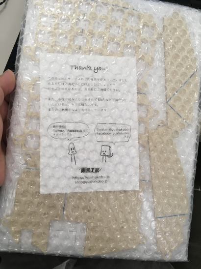

# Tilting-and-Tenting Case for ErgoDash mini 

## 概要 
[ErgoDash mini](https://github.com/omkbd/ErgoDash/tree/master/mini)用に作成した自作アクリルケースの図面（.aiと.epsファイル）。
図面ファイルは[遊舎工房さんのレーザーカットサービス](https://yushakobo.jp/lasercut/)のテンプレートファイル（Laser_450x300_template.ai）に合わせてAdobe Illustratorで作成した。既に似たようなことをやっている方はいるような気はするものの、誰か必要な人がいるかもしれないので、ここに記録の意味も込めて公開。

遊舎工房さんの通販でキットを購入したErgoDash・ErgoDash miniを肩こり対策として使っていたのだが、付属のアクリルケースではキーボードの傾斜調節がほぼできない状態でもどかしかった。東急ハンズで購入したゴムスペーサーを小さくカットして使ってみたのの、使い勝手は正直よろしくない。そんな中、X（旧Twitter）でくろみー(@clomie)さんの[ティルトテント型アクリルプレート装着のErgoDash](https://x.com/clomie/status/1134790717656616962?s=20)を見て、良いアイデアなので自分でもやってみたくなった。幸いにもキット組み立て時にキー・LEDともにホットスワップ化したたおかげでケースの換装も可能であり、えいやっと自分でErgoDash mini用の図面を作成した。ただし、私が作成したのは親指キーを左右でそれぞれひとつずつ取り除いたバージョン。作成に当たっては、[ErgoDash mini公式の図面](https://github.com/omkbd/ErgoDash/tree/master/mini/Case)、くろみーさんが[公開している図面](https://github.com/clomie/ergodash-tilting-tenting-case)ならびに[作成風景の動画](https://x.com/clomie/status/1134738796367376384?s=20)を参考にさせてもらいました。多謝。

以下は、元のアクリルケースと自作アクリルケースの比較図、そして公開している図面。1枚のアクリル板から切り出すため、余白部分から予備パーツ1セット分（左右対称なのでこれでOK）を確保する配置とした。実際には自分用のロゴを刻印してもらったが、公開版からは削除。

ErgoDash miniについて知らない人はここには来ない気がするものの、以下に紹介記事をば。
- [遊舎工房 ErgoDash mini キット](https://shop.yushakobo.jp/products/ergodash-mini)
- [遊舎工房でパーツを選び ErgoDash mini を組み立てる｜僕だけの自作キーボード](https://tobalog.com/2019/05/zisaku-keyboard-2/)
- [自作キーボードキットのErgodash miniを素人が気力だけで作ってみた](https://note.com/alpes/n/nd10ddded861a)
- [予算約2万5000円、完成までに4時間18分！自作キーボードキット「ErgoDash mini」に初挑戦](https://dime.jp/genre/843519/)
- [ErgoDash mini Build Log](https://log.brdr.jp/post/352)
- [念願の分割キーボード ErgoDash mini をつくった](https://kasumi8pon.hateblo.jp/entry/2020/10/26/003223)
- [[遊舎工房ギルドクエスト] ErgoDash miniのビルドログ](https://jun3010.me/ergo-dash-mini-buildlog-22625.html)
- [雑記帳 ErgoDash miniビルドログ](https://yokada996.hatenablog.com/entry/2022/12/31/020006)
- [雑記帳 ErgoDash miniのVIA対応](https://yokada996.hatenablog.com/entry/2023/01/03/140529)
- [サイレントでホットスワップなErgoDash miniを制作(前編)](https://hinastory.github.io/cats-cats-cats/2019/01/06/ergodash-mini-1/)
- [サイレントでホットスワップなErgoDash miniを制作(後編)](https://hinastory.github.io/cats-cats-cats/2019/01/10/ergodash-mini-2/)
- [BLE Micro ProでErgoDash miniをワイヤレス化する](https://log.brdr.jp/post/395)

　
　
　

作例など。
- [R_botamochi](https://x.com/R_botamochi/status/1530157845043621889?s=20)
- [cydonianbanana](https://x.com/cydonianbanana/status/1117365222405054470?s=20)
- [anoma10caris](https://x.com/anoma10caris/status/1685117770596487168?s=20)
- [buster_rabbit](https://x.com/buster_rabbit/status/1107659887171923968?s=20)
- [taga090](https://x.com/taga090/status/1065775547957956611?s=20)
- [niwatoriman](https://x.com/niwatoriman/status/1099936557883043840?s=20)
- [tanuki_kegawa](https://x.com/tanuki_kegawa/status/1129987872273027074?s=20)
- [kenji1203](https://x.com/kenji1203/status/1072868727832473604?s=20)
- [nitodadada](https://x.com/nitodadada/status/1180521786942750721?s=20)
- [tobalog](https://x.com/tobalog/status/1120633544634589184?s=20)
- [wk](https://x.com/wk/status/1086955221492748288?s=20)
- [mimizuku_](https://x.com/mimizuku_/status/1090237228750581761?s=20)
- [ryo_dg](https://x.com/ryo_dg/status/1101160010728390656?s=20)
- [nitodadada](https://x.com/nitodadada/status/1061993909495062528?s=20)
- [lyp_tus/status](https://x.com/lyp_tus/status/1110906547108900864?s=20)
- [element874_Re](https://x.com/element874_Re/status/1538477801115774976?s=20)
- [No292nukegara](https://x.com/No292nukegara/status/1211846687477493762?s=20)
- [kurubushi312](https://x.com/kurubushi312/status/1152595963074113538?s=20)
- [murakom](https://x.com/murakom/status/1260175781168214017?s=20)
- [yuroyoro](https://x.com/yuroyoro/status/1119975413122363392?s=20)
- [ItakuMasakari](https://x.com/ItakuMasakari/status/1145313560349696001?s=20)
- [ymrl](https://x.com/ymrl/status/1087377222543933440?s=20)
- [qudan_sato](https://x.com/qudan_sato/status/1141946665382924288?s=20)
- [zuk2y](https://x.com/zuk2y/status/1228600523864985600?s=20)
- [zuk2y](https://x.com/zuk2y/status/1492481255794872325?s=20)
- [cydonianbanana](https://x.com/cydonianbanana/status/1532633950635536385?s=20)
- [aa7th](https://x.com/aa7th/status/1468891543008604163?s=20)

　
　
　

## 組み立てに必要なもの
スペーサー用のホール径はM5なので、このホール径に合わせてボルト・ナット・スペーサーを購入。ボルトは高さ調節のために2種類用意したが、その時のお好みで選択。ネット上で購入できる安価なパーツはたくさんあるが、中国産のボルト・ナットのねじきりの精度がいまいちなので、できればきちんとしたパーツを購入したいところ。なるべく国産ものを狙いたかったので調べたところ、[ErgoDashをカスタマイズした際のパーツ構成](https://dosssman.github.io/projects/2020-08-ergodash-build/)を公開している方がいたので参考にしつつ、以下のパーツを選択、利用した。

- M5ボルト 15mm以上 ×8本
	- [TRUSCO(トラスコ) 六角穴付ボルト ステンレス全ネジ M5×15 39本入 B44-0515](https://www.amazon.co.jp/gp/product/B002A5RKVA/ref=ppx_od_dt_b_asin_title_s01?ie=UTF8&th=1) 
	- [TRUSCO(トラスコ) 六角穴付ボルト ステンレス全ネジ M5×20 34本入 B44-0520](https://www.amazon.co.jp/gp/product/B002A5KKH6/ref=ppx_od_dt_b_asin_title_s00?ie=UTF8&th=1)
- M5ナット ×16個
	- [TRUSCO(トラスコ) 六角ナット3種 ステンレス サイズM5×0.8 80個入 B57-0005](https://www.amazon.co.jp/gp/product/B002A5PHC4/ref=ppx_od_dt_b_asin_title_s00?ie=UTF8&th=1)
- M5スペーサー 6mm ×8個
	- [WILCO, 鉄 スペーサー丸型中空  三価クロメート M5L6, CF-506E を予備を含めて10個購入](https://wilco.jp/products/F/CF-0000E.html#page5)
- クッションゴム 8mm ×8個
	- [3M しっかりつくクッションゴム 7.9x2.2mm 丸形 22粒 CS-01](https://www.amazon.co.jp/3M-%E3%81%97%E3%81%A3%E3%81%8B%E3%82%8A%E3%81%A4%E3%81%8F%E3%82%AF%E3%83%83%E3%82%B7%E3%83%A7%E3%83%B3%E3%82%B4%E3%83%A0-7-9x2-2mm-22%E7%B2%92-CS-01/dp/B00V5MQQ5A/ref=sr_1_5?__mk_ja_JP=%E3%82%AB%E3%82%BF%E3%82%AB%E3%83%8A&dchild=1&keywords=%E3%82%AF%E3%83%83%E3%82%B7%E3%83%A7%E3%83%B3%E3%82%B4%E3%83%A0%2B8mm%E5%BE%84&qid=1621675112&sr=8-5&th=1)

なお上記のものは追加購入したものであり、実際にはErgoDash miniの通販キット付属の六角スペーサーやねじを利用して組み立て作業を行っている。
　
　
　
　
　

## アクリル板からの切り出し
[遊舎工房さんのレーザーカットサービス](https://yushakobo.jp/lasercut/)だと2mmと3mmが選択可能なので、付属のアクリル樹脂ケースに合わせて3mm厚を選択し、A4アクリルボード1枚分のカットとして依頼→発注。遊舎工房で購入したErgoDash mini自作キット付属のアクリル樹脂ケースの厚さは3mmだったので、これにならった。

アクリル樹脂の強度について調べたり問い合わせたところ、押出だろうがキャスト材だろうが応力かかり過ぎたら割れるので、好きな色やデザインでやってしまったほうがいいという助言をもらった。また、最近は金属パーツでの成形が流行っているらしい。

以下のように梱包されたカット済みアクリル樹脂が1週間くらいで届いた。

　
　
　

## 組み立て例
実際にケースをPCBに装着、そして必要なパーツを加えて完成。作成から2年ほど経ったが、アクリルパーツの破損等一切なく使用できている。ただ、若干自重が足りないので配置時の安定感をどうにかできないかと思案中。

##

